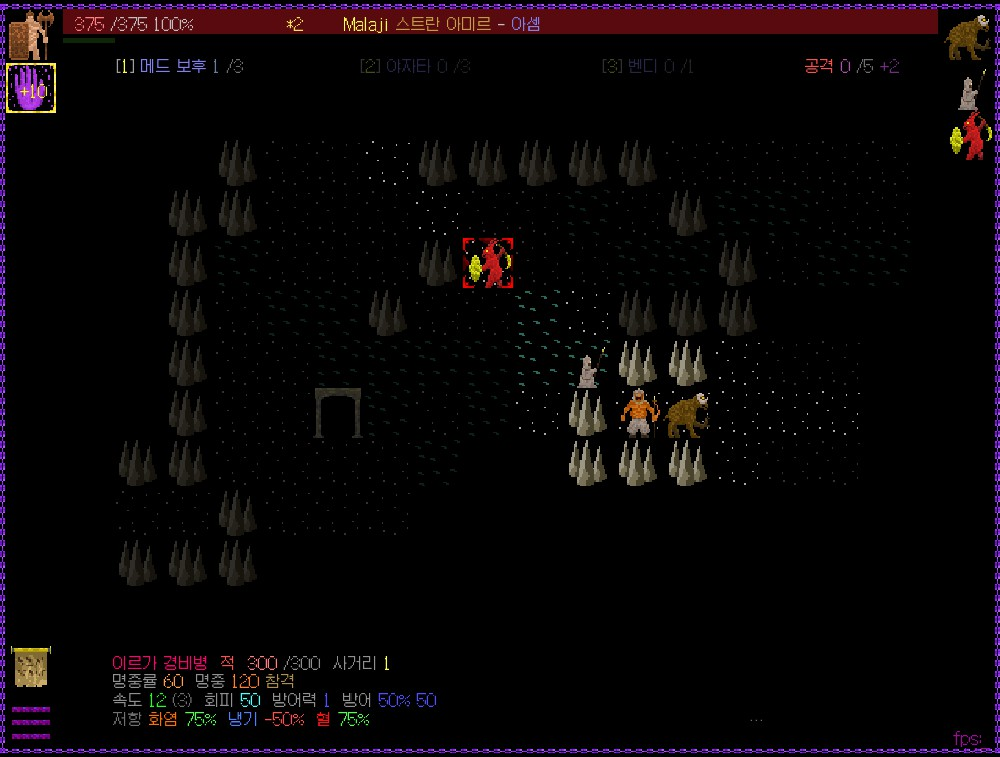

# Path of Achra 한국어 패치 v1.3


**Path of Achra**의 비공식 한국어 패치입니다.

- **최신 버전**: `v1.3`
- **게임**: [Path of Achra](https://store.steampowered.com/app/2128270/Path_of_Achra/) (Steam)
- **엔진**: Godot 3.5.2
- **번역 범위**: JSON 데이터 테이블 + GDScript 하드코딩 문자열 + TSCN UI 라벨
- **번역 항목**: 약 4,759개 문자열 + 60개 GDScript 파일 + 17개 TSCN 파일

## 스크린샷

| 메인 메뉴 | 캐릭터 생성 | 전투 |
|:---:|:---:|:---:|
|  |  |  |

| 레벨업 | 사망 화면 |
|:---:|:---:|
|  |  |

## 다운로드

- [GitHub Release v1.3](https://github.com/hanpaemo/path-of-achra-korean-patch/releases/tag/v1.3)
- 권장 파일: `PathofAchra-ko-full.pck`

## 최신 변경 사항

- 한글 패치 적용 시 기도가 충전되지 않던 문제 수정
- `평정`, `동조` 용어 통일 및 관련 설명문 정리
- 전투 중 버프 팝업에 적용량 표시 추가
- `순간이동`, 시구 하단 출처, 트레잇 화면 잔여 영문 수정
- 내부 식별자 필드 보호 검증 추가로 동일 계열 회귀 방지

## 설치 방법

1. [Releases](../../releases) 페이지에서 최신 `PathofAchra-ko-full.pck`를 다운로드합니다.
2. 게임 설치 폴더를 엽니다.
   - Steam → Path of Achra 우클릭 → 관리 → 로컬 파일 탐색
   - 기본 경로: `C:\Program Files (x86)\Steam\steamapps\common\Path of Achra\`
3. 기존 `PathofAchra.pck` 파일을 백업합니다. (이름을 `PathofAchra.pck.backup` 등으로 변경)
4. 다운로드한 `PathofAchra-ko-full.pck`를 `PathofAchra.pck`로 이름을 변경하여 게임 폴더에 넣습니다.
5. 게임을 실행합니다.

## 제거 방법

백업해둔 원본 `PathofAchra.pck.backup` 파일의 이름을 `PathofAchra.pck`로 되돌리면 됩니다.

## 주의사항

- 게임 업데이트 시 `PathofAchra.pck`가 원본으로 덮어씌워질 수 있습니다. 업데이트 후 패치를 다시 적용해주세요.
- 일부 캐릭터 이름, 신 이름 등 게임 고유명사는 영어 그대로 유지됩니다.
- 문제가 있으면 [Issues](../../issues)에 제보해주세요.

## 변경 이력

### v1.3

- 기도 충전 로직 복구
- 전투 버프 팝업 수치 표시 추가
- 전투/트레잇/시구 화면 잔여 영문 정리
- 내부 enum 번역 회귀 방지 검증 추가

### v1.2

- 트레잇 UI 컬럼 비노출 문제 수정
- 트레잇 화면 잔여 영문 UI 번역
- 상위 직업 해금 팝업 문구 정리

### v1.1

- 미번역 영문 130건 번역
- 용어 불일치 274건 통일
- UI 기본 문구 정리

## 빌드 (개발자용)

```bash
python translate_gdc_strings.py   # GDScript 번역 + 컴파일
python translate_tscn.py          # TSCN UI 번역
python build_korean_patch.py      # PCK 빌드
python deploy_patch.py            # 게임 폴더에 배포
```

## 크레딧

- 번역: [한패모](https://hanpaemo.blogspot.com)
- 원작: [Ulfsire](https://store.steampowered.com/app/2128270/Path_of_Achra/)
- 후원: [Ko-fi](https://ko-fi.com/hanpaemo)
